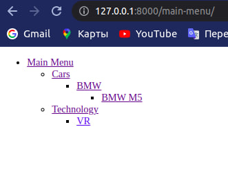
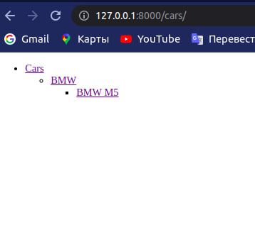

# Tree Menu App

---
Django app that implements a tree menu using a template tag

### Cloning repository
    git clone https://github.com/javokhirkasimov/tree_menu.git

### Getting Started
Create a .env file and fill it according to .env.example

Install dependencies

    python manage.py makemigrations
    python manage.py migrate
    python manage.py createsuperuser
    python manage.py runserver

### Examples

